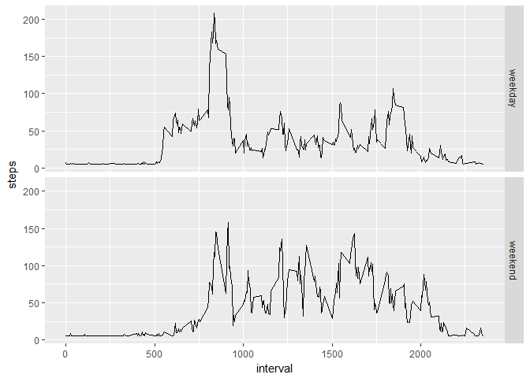

# Reproducible Research: Peer Assessment 1


```r
library(dplyr)
library(ggplot2)
```

## Loading and preprocessing the data
Loading the data into act variable and formating the second column as date:

```r
act <- read.csv("activity.csv")
act[, 2] <- as.Date(act[, 2], "%Y-%m-%d")
```

## What is mean total number of steps taken per day?
Calculating the sum of the steps for each individual day:

```r
sums <- tapply(act[, 1], act[, 2], sum)
hist(sums, xlab = "Total daily steps taken", main = "Histogram")
abline(v = mean(sums, na.rm = TRUE), col = "red")
```

<!-- -->

```r
mean(sums, na.rm = TRUE)
```

```
## [1] 10766.19
```

```r
median(sums, na.rm = TRUE)
```

```
## [1] 10765
```
We can see that in the majority of the days, the total steps range between 10000 and 15000.

## What is the average daily activity pattern?
Calculating the means for each individual interval:

```r
means <- as.data.frame(tapply(act[, 1], act[, 3], mean, na.rm = TRUE))
means[, 2] <- rownames(means)
rownames(means) <- 1:288
names(means) <- c("steps", "intervals")
with(means, plot(intervals, steps, type = "l", xlab = "Intervals", ylab = "Average number of steps", main = "Daily pattern"))
```

<!-- -->

```r
max(means[,1])
```

```
## [1] 206.1698
```

```r
means[which(means[, 1] == max(means[, 1]))[[1]], 2]
```

```
## [1] "835"
```
As expected, there is a time in the day when no steps are obsereved. Persumably this is the time where the subjects sleep.

## Imputing missing values

```r
sum(is.na(act[, 1]))
```

```
## [1] 2304
```
Considering the volume of our missing values, our results may not be accurate. For that purpose we will impute the missing values using two different ways. Then we will compare the results in a common plot:
### Imputing NAs by the means of the intervals:


```r
act2 <- act
logical <- is.na(act2[, 1])
for (i in 1:17568) {
    if (logical[i]) {
        act2[i, 1] <- means[which(act2[i,3] == means[, 2]), 1]
    }
}
sums2 <- tapply(act2[, 1], act2[, 2], sum)
```

### Imputing NAs by the means of the weekdays:


```r
act3 <- act
act3[, 4] <- weekdays(act3[, 2])
means3 <- as.data.frame(tapply(act[, 1], act3[, 4], mean, na.rm = TRUE))
means3[, 2] <- rownames(means3)
rownames(means3) <- 1:7
names(means3) <- c("steps", "weekdays")
for(i in 1:17568) {
    if (logical[i]) {
        act3[i, 1] <- means3[which(act3[i, 4] == means3[, 2]), 1]
    }
}
sums3 <- tapply(act3[, 1], act3[, 2], sum)
```
 
### Producing histograms, medians and means for the two approaches:


```r
par(mfrow = c(1, 2))
hist(sums2, xlab = "Total daily steps taken", main = "Histogram (NA imuted by inter)")
abline(v = mean(sums2), col = "red")
hist(sums3, xlab = "Total daily steps taken", main = "Histogram (NA imuted by day)")
abline(v = mean(sums3), col = "red")
abline(v = median(sums3), col = "blue")
```

<!-- -->

```r
mean(sums2)
```

```
## [1] 10766.19
```

```r
median(sums2)
```

```
## [1] 10766.19
```

```r
mean(sums3)
```

```
## [1] 10821.21
```

```r
median(sums3)
```

```
## [1] 11015
```
As we can see, the difference is not very noticeable, neither between the two ways of imputing nor between them and the original plot. Notice however that the mean of the first way stays the same as the original. That is because the missing values are whole days and each daily mean that we imputed matches the previously calculated mean. As a more suitable imputing, we choose to proceed the analysis using the second method.

## Are there differences in activity patterns between weekdays and weekends?
Adding factor variables breaking our data in two groups, weekdays and weekends:

```r
names(act3)[4] <- "day"
act3 <- mutate(act3, weekend = ifelse(day %in% c("Saturday", "Sunday"), "weekend", "weekday"))
act3[, 5] <- as.factor(act3[, 5])
mplot <- as.data.frame(tapply(subset(act3$steps, act3$weekend == "weekday"), subset(act3$interval, act3$weekend == "weekday"), mean))
mplot2 <- as.data.frame(tapply(subset(act3$steps, act3$weekend == "weekend"), subset(act3$interval, act3$weekend == "weekend"), mean))
mplot[, 2] <- rownames(mplot)
mplot2[, 2] <- rownames(mplot2)
rownames(mplot) <- 1:288
rownames(mplot2) <- 1:288
mplot[, 3] <- "weekday"
mplot2[, 3] <- "weekend"
names(mplot) <- c("steps", "interval", "weekend") ; names(mplot2) <- c("steps", "interval", "weekend")
fullplot <- rbind(mplot, mplot2)
fullplot[, 2] <- as.numeric(fullplot[, 2])
g <- ggplot(fullplot, aes(interval, steps, group = 1)) + facet_grid(weekend~.) + geom_line()
print(g)
```

<!-- -->
The two plots are slightly different, providing us with some useful information. We can observe that the sleeping hours are somewhat longer during the weekends. We can also see that the volume of steps during the weekends is more spread whereas during the weekdays we see that it is mostly observed in the beginning of the day.
